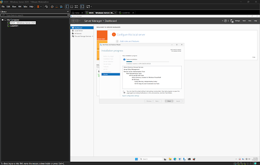
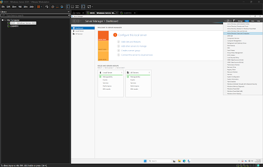
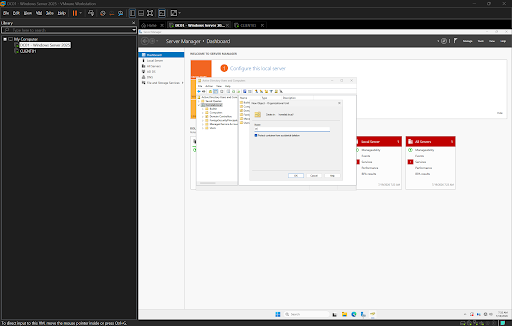
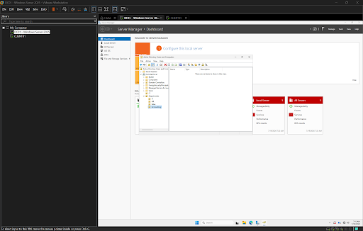
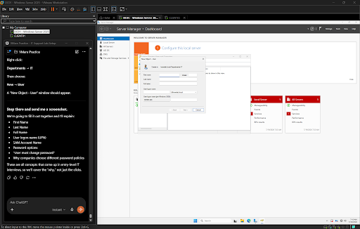
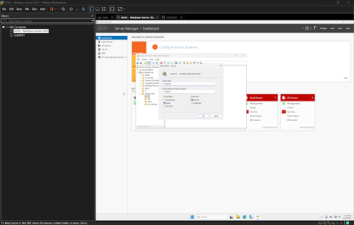
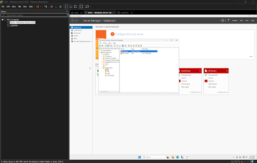
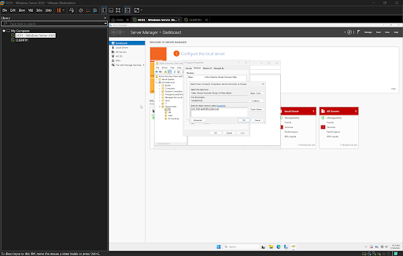

# Active Directory Setup

## Objective

Deploy Active Directory Domain Services (AD DS) on a Windows Server, promote the server to a Domain Controller, organize the domain using Organizational Units (OUs), create user accounts, and implement security groups following enterprise best practices.

---

## Environment

- Hypervisor: VMware Workstation Pro
- Operating System: Windows Server 2025
- Domain: homelab.local
- Network Type: NAT (VMnet8)

---

## Installing Active Directory Domain Services

The Active Directory Domain Services (AD DS) role was installed using Server Manager.

This role provides centralized authentication, authorization, and directory management for Windows environments.

---

## Installation Complete

After installation, Windows Server confirmed that the Active Directory Domain Services role was successfully installed and ready for domain controller promotion.

---

## Creating Organizational Units

An Organizational Unit (OU) named **IT** was created to logically organize users and security groups.

Organizational Units allow administrators to:

- Separate departments
- Delegate administration
- Apply Group Policies
- Keep Active Directory organized

---

## Creating Department Organizational Units

Additional Organizational Units were created beneath the Departments container to simulate an enterprise environment.

Departments created include:

- IT
- HR
- Sales
- Accounting

This structure allows each department to be managed independently while maintaining centralized administration.

---

## Creating User Accounts

A new Active Directory user account was created inside the IT Organizational Unit.

The account includes:

- First Name
- Last Name
- User Logon Name (UPN)
- Initial Password
- Password Change Requirement

---

## User Successfully Created

After completing the account creation wizard, the new user appeared within the IT Organizational Unit.

This verifies that the user account was successfully created and stored within Active Directory.

---

## Creating a Security Group

A Global Security Group named **IT Support** was created within the IT Organizational Unit.

This group will later be used to assign permissions to multiple users instead of assigning permissions individually.

Benefits include:

- Easier administration
- Scalable permission management
- Simplified onboarding
- Consistent security practices

---

## Domain Controller Promotion

After installing AD DS, the server was promoted to a Domain Controller for the **homelab.local** domain.

This process creates the domain database, enables authentication services, and establishes the first Domain Controller within the environment.

---

## Domain Controller Deployment Complete

Windows Server successfully completed the Active Directory deployment.

The server now functions as:

- Domain Controller
- DNS Server
- Authentication Server

This forms the foundation of the enterprise environment used throughout the remainder of the lab.

---

## Security Group Membership

The previously created user account was added to the **IT Support** Security Group.

Using security groups instead of assigning permissions directly to user accounts follows Microsoft's recommended administrative model.

Advantages include:

- Easier permission management
- Faster onboarding
- Simplified offboarding
- Reduced administrative errors
- Role-based access control (RBAC)

*(Add your remaining screenshots here once uploaded.)*

---

## Skills Demonstrated

- Windows Server Administration
- Active Directory Domain Services
- Domain Controller Deployment
- Organizational Unit Design
- User Account Management
- Security Group Administration
- Group-Based Access Control
- Windows Identity Management
- Enterprise Directory Structure

---

## Tools Used

- VMware Workstation Pro
- Windows Server 2025
- Server Manager
- Active Directory Users and Computers (ADUC)

---

## Lessons Learned

This lab introduced the core administrative tasks performed by Windows Server administrators and Help Desk technicians.

Rather than storing users in a single location, Organizational Units provide logical separation between departments, making administration and Group Policy deployment significantly easier.

Security Groups simplify permission management by allowing administrators to assign access to groups instead of individual users. This approach scales efficiently across organizations with hundreds or thousands of employees and follows Microsoft's recommended best practices.

Deploying Active Directory establishes centralized identity management, allowing future services such as DNS, DHCP, Group Policy, File Servers, and authentication to integrate into a single enterprise environment.
