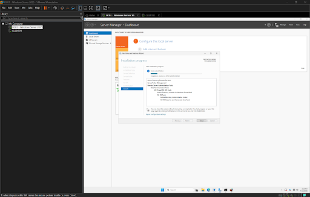
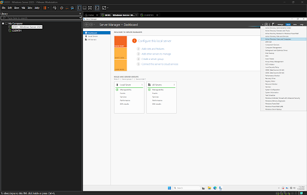
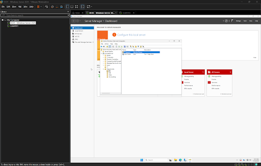
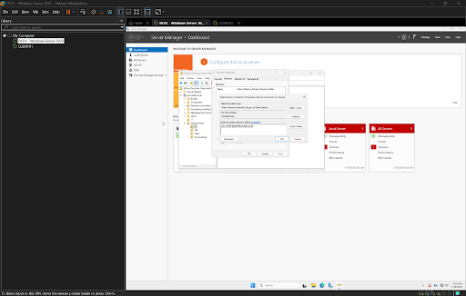

# Installing Active Directory Domain Services (AD DS)

## Objective

Deploy Active Directory Domain Services (AD DS) on Windows Server 2025 and promote the server to the first Domain Controller for the **homelab.local** domain. This establishes centralized authentication, authorization, and directory services for the enterprise lab environment.

---

## Lab Environment

- **Hypervisor:** VMware Workstation Pro
- **Operating System:** Windows Server 2025
- **Server Name:** DC01
- **Domain:** homelab.local
- **Network Type:** NAT (VMnet8)

---

# Installing Active Directory Domain Services

The Active Directory Domain Services (AD DS) server role was installed through **Server Manager**.

Active Directory provides centralized identity management by allowing administrators to manage users, computers, groups, and security policies from a single location.

### Install AD DS

---

# Installation Complete

After the installation completed successfully, Windows Server confirmed that the Active Directory Domain Services role had been installed and was ready to be promoted to a Domain Controller.

### Installation Complete

---

# Promoting the Server to a Domain Controller

Once the AD DS role was installed, the server was promoted to the first Domain Controller for a new forest named **homelab.local**.

During this process Windows Server:

- Created a new Active Directory forest
- Installed DNS
- Configured the Active Directory database
- Prepared the server to provide centralized authentication services

### Promote Domain Controller

---

# Domain Controller Deployment Complete

After the promotion completed successfully, Windows Server restarted and became the first Domain Controller for the **homelab.local** domain.

The server now functions as:

- Domain Controller
- DNS Server
- Authentication Server
- Active Directory Database Host

This forms the foundation for the remainder of the enterprise home lab.

### Deployment Complete

---

# Verification

The installation was verified by confirming:

- Active Directory Domain Services installed successfully
- Domain Controller promotion completed without errors
- The **homelab.local** domain was created
- Active Directory Users and Computers became available
- DNS was installed automatically during promotion

---

# Skills Demonstrated

- Windows Server Administration
- Active Directory Domain Services (AD DS)
- Domain Controller Deployment
- Active Directory Forest Creation
- DNS Installation
- Enterprise Identity Management
- Server Role Installation

---

# Tools Used

- VMware Workstation Pro
- Windows Server 2025
- Server Manager
- Active Directory Domain Services
- Active Directory Users and Computers (ADUC)

---

# Lessons Learned

Deploying Active Directory is one of the first steps in building an enterprise Windows environment. Installing the AD DS role alone does not create a domain; the server must also be promoted to a Domain Controller.

During this lab, I learned how Active Directory centralizes authentication and directory management while automatically integrating DNS during the promotion process. This provides the foundation for future services such as Organizational Units, user accounts, security groups, Group Policy, DHCP, and file servers.
