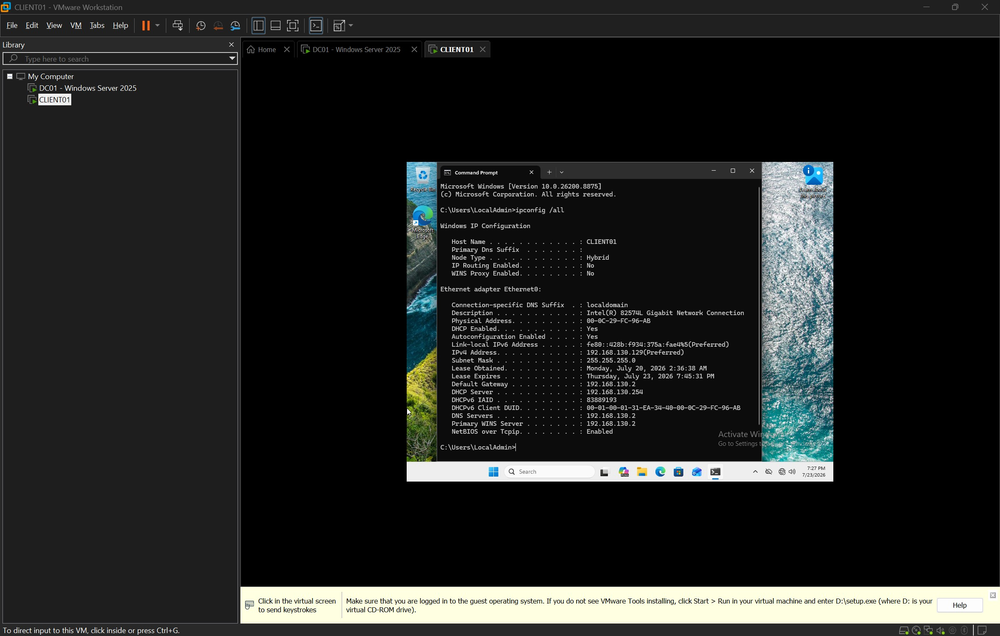
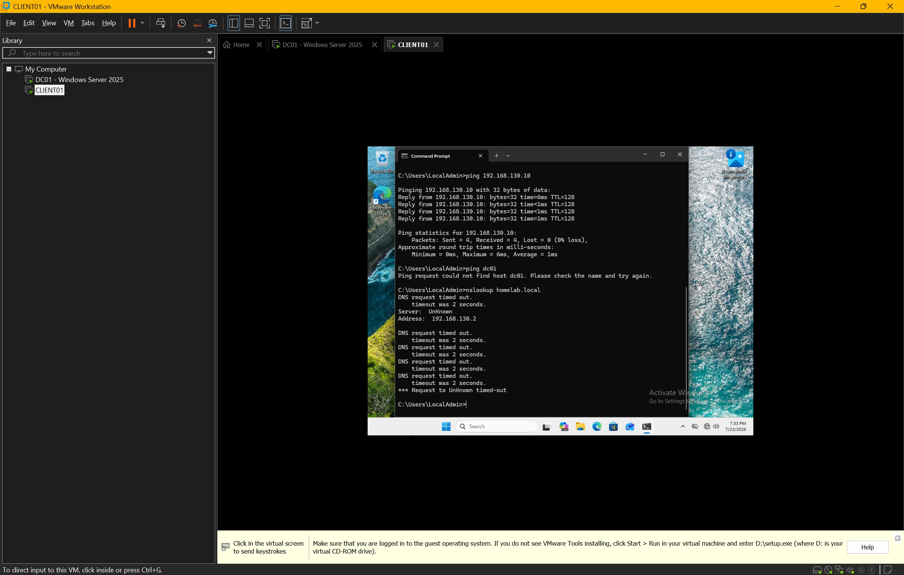
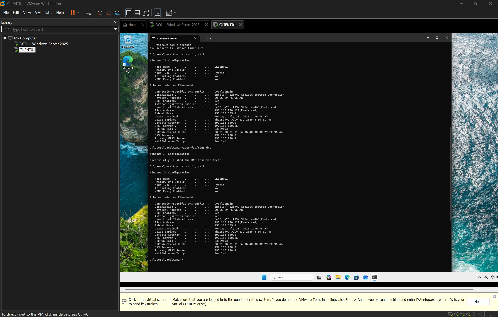
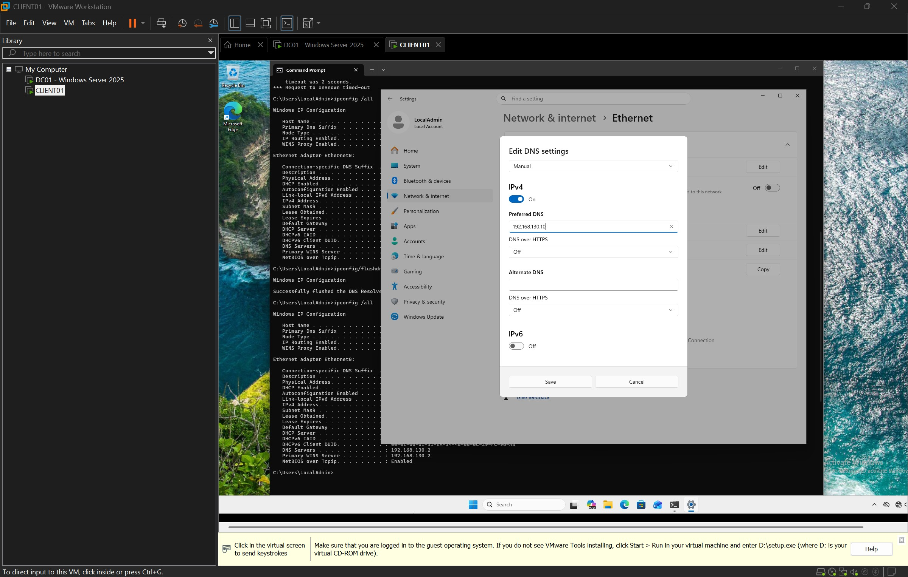
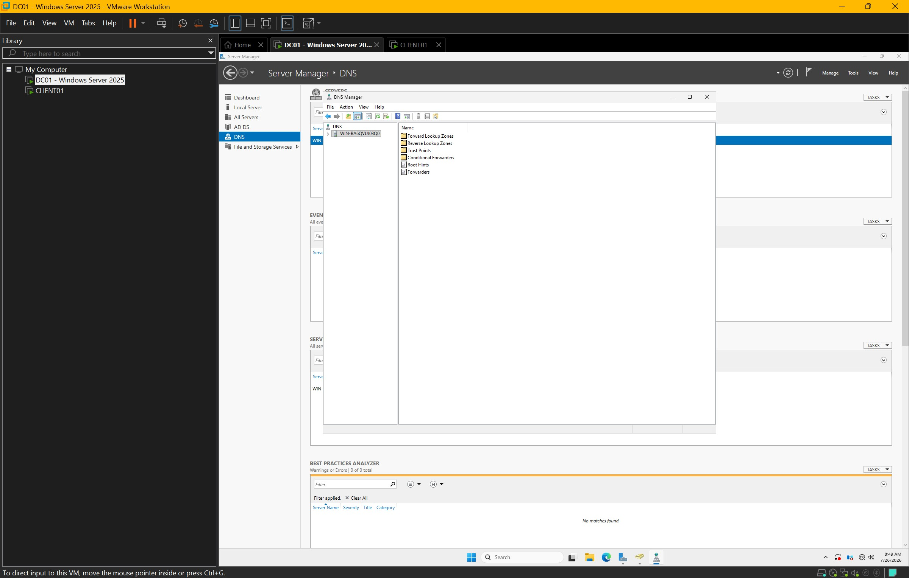
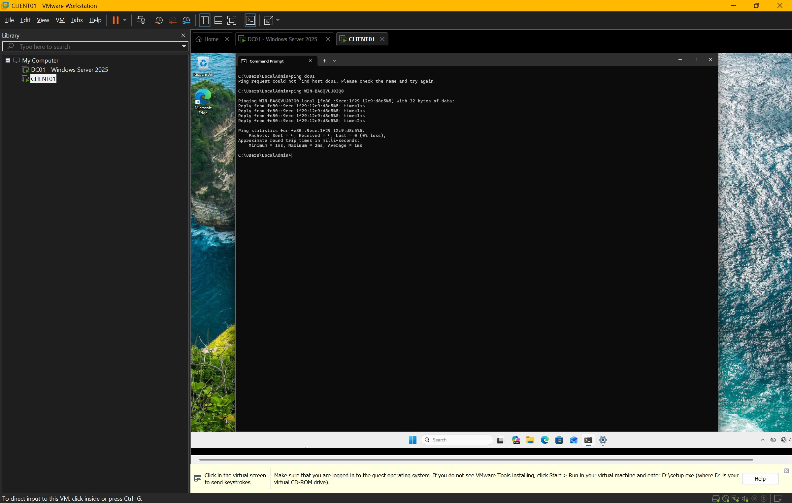
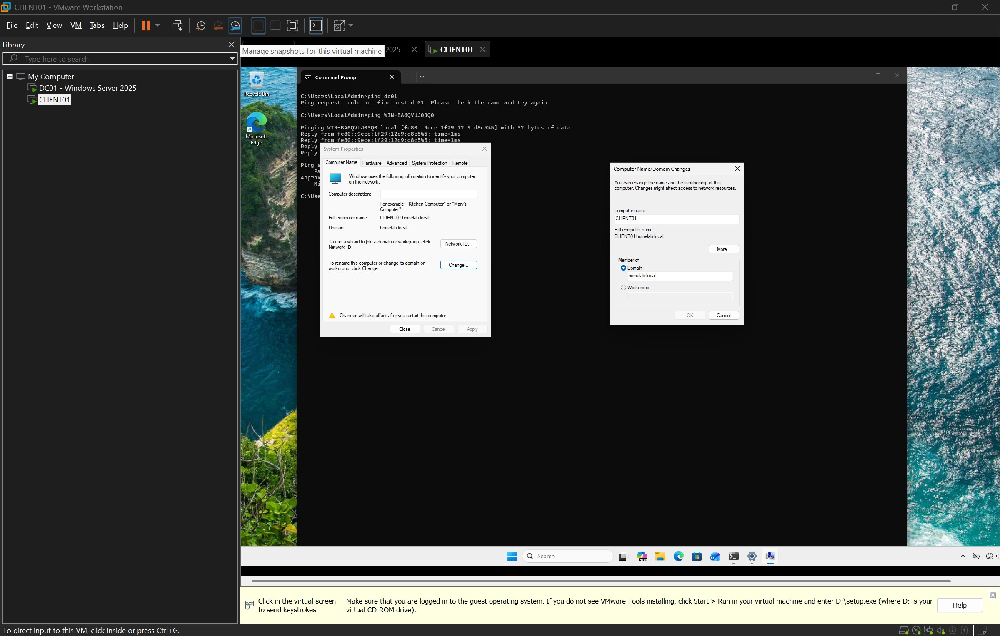
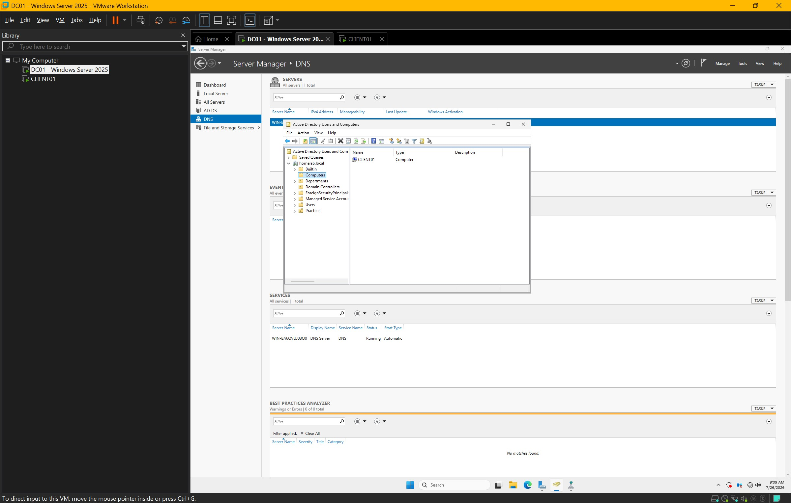
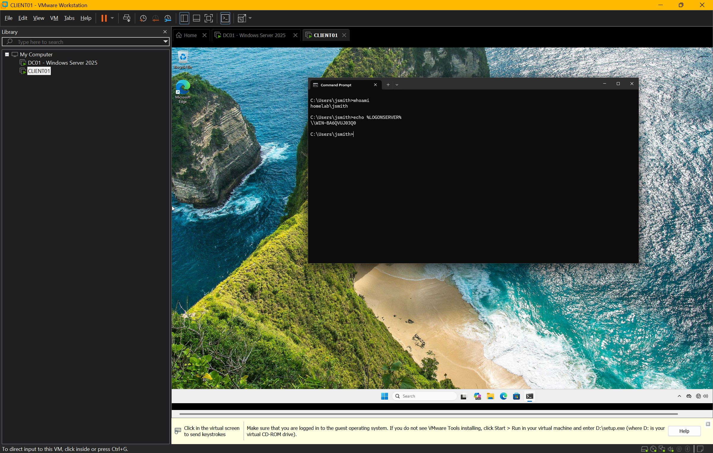

# Joining a Windows Client to an Active Directory Domain

## Overview

This lab demonstrates the process of joining a Windows 11 client computer (`CLIENT01`) to an Active Directory domain hosted on a Windows Server 2025 Domain Controller (`DC01`). Before joining the domain, I verified network connectivity, diagnosed DNS-related issues, corrected the client's DNS configuration, and confirmed successful authentication against the Domain Controller.

This exercise mirrors a common IT support task when deploying new computers in an enterprise environment.

---

## Objective

- Verify network connectivity between the client and the Domain Controller.
- Troubleshoot DNS name resolution.
- Configure the client to use the Domain Controller as its DNS server.
- Join the Windows client to the `homelab.local` Active Directory domain.
- Verify the computer account appears in Active Directory.
- Confirm successful domain authentication.

---

## Lab Environment

| Component | Configuration |
|-----------|---------------|
| Hypervisor | VMware Workstation Pro |
| Domain Controller | Windows Server 2025 |
| Client | Windows 11 |
| Domain | homelab.local |
| Domain Controller IP | 192.168.130.10 |
| DNS Server | 192.168.130.10 |

---

# Step 1 — Troubleshoot DNS Resolution

Before attempting to join the domain, I verified the client's network configuration using `ipconfig /all` and cleared the local DNS cache.

I then tested name resolution and discovered the client could communicate with the Domain Controller by IP address, but DNS lookups for the domain were failing.

### Screenshots







---

# Step 2 — Configure the Correct DNS Server

The issue was caused by the client using an incorrect DNS server.

I updated the Preferred DNS Server to point directly to the Domain Controller.

Preferred DNS:

```
192.168.130.10
```

### Screenshot



---

# Step 3 — Verify the DNS Configuration

After correcting the DNS settings, I verified:

- Network connectivity
- Successful communication with the Domain Controller
- Correct DNS configuration

I also reviewed the DNS Manager configuration and confirmed the server hostname.

### Screenshots





---

# Step 4 — Join CLIENT01 to the Domain

Once DNS was functioning correctly, I joined the Windows client to the `homelab.local` domain.

After joining the domain, the computer was restarted to complete the process.

### Screenshot



---

# Step 5 — Verify the Computer in Active Directory

After the restart, I confirmed that CLIENT01 appeared inside the **Computers** container in Active Directory Users and Computers.

This verified that the Domain Controller successfully created the computer account.

### Screenshot



---

# Step 6 — Verify Domain Authentication

Finally, I signed in using a domain user account and verified authentication using:

```
whoami
```

and

```
echo %LOGONSERVER%
```

These commands confirmed:

- The logged-in account belongs to the Active Directory domain.
- Authentication was performed by the Domain Controller.

### Screenshot



---

# Skills Demonstrated

- Active Directory Domain Join
- Windows 11 Administration
- DNS Troubleshooting
- Network Configuration
- Client Authentication
- Active Directory Users and Computers
- Windows Command Line
- Enterprise Troubleshooting Methodology

---

# Tools Used

- VMware Workstation Pro
- Windows Server 2025
- Windows 11
- Active Directory Users and Computers
- DNS Manager
- Command Prompt

---

# Lessons Learned

This lab reinforced the importance of DNS within an Active Directory environment. Even when basic IP connectivity is functioning, a client cannot successfully join a domain if DNS is not correctly configured.

By troubleshooting the issue before joining the domain, I gained practical experience diagnosing real-world problems commonly encountered by IT Support and Help Desk technicians during workstation deployments.
