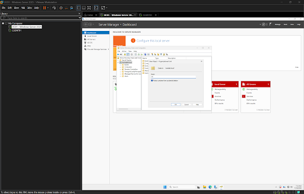
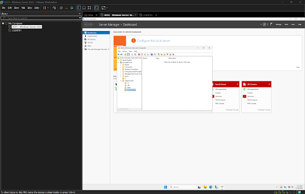

# Organizational Units (OUs)

## Objective

Create an Organizational Unit (OU) structure that organizes users and resources into departments following enterprise Active Directory best practices.

---

## Environment

- Hypervisor: VMware Workstation Pro
- Operating System: Windows Server 2025
- Domain: homelab.local
- Management Tool: Active Directory Users and Computers (ADUC)

---

## Creating the IT Organizational Unit

The first Organizational Unit (OU) named **IT** was created within the domain.

Organizational Units provide a logical way to organize objects such as users, computers, and security groups.

Benefits include:

- Easier administration
- Department separation
- Group Policy targeting
- Simplified management

---

## Creating Department Organizational Units

A parent Organizational Unit named **Departments** was created to simulate an enterprise environment.

Additional Organizational Units were created beneath it for each department:

- IT
- HR
- Sales
- Accounting

Using a departmental structure keeps Active Directory organized and allows administrators to manage each department independently.

---

## Why Organizational Units Matter

Organizational Units are one of the most important components of Active Directory.

Rather than storing every user in a single location, administrators organize objects based on departments, locations, or business functions.

This allows administrators to:

- Apply Group Policies to specific departments
- Delegate administrative permissions
- Simplify user management
- Reduce administrative errors
- Scale Active Directory as the organization grows

---

## Skills Demonstrated

- Active Directory Administration
- Organizational Unit Design
- Enterprise Directory Organization
- Windows Server Administration
- Microsoft Active Directory Best Practices

---

## Tools Used

- VMware Workstation Pro
- Windows Server 2025
- Active Directory Users and Computers (ADUC)

---

## Lessons Learned

Creating Organizational Units establishes a scalable foundation for Active Directory.

Instead of managing hundreds of users in a single container, departments can be separated into logical structures that make administration significantly easier.

This organizational approach becomes increasingly valuable as environments grow and additional services such as Group Policy, file permissions, and delegated administration are introduced.
