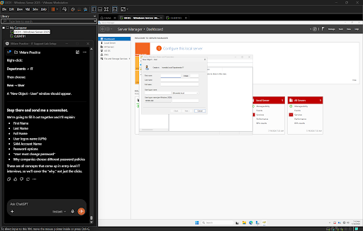
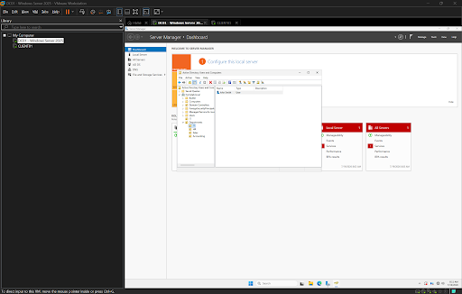
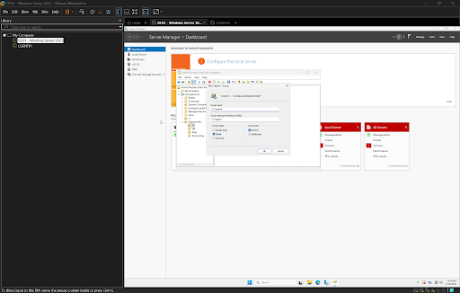

# Users and Security Groups

## Objective

Create Active Directory user accounts, implement security groups, and assign users to groups following enterprise identity and access management best practices.

---

## Environment

- Hypervisor: VMware Workstation Pro
- Operating System: Windows Server 2025
- Domain: homelab.local
- Management Tool: Active Directory Users and Computers (ADUC)

---

## Creating a User Account

A new Active Directory user account was created within the **IT** Organizational Unit.

The account was configured with:

- First Name
- Last Name
- User Logon Name (UPN)
- Initial Password
- Password Change Requirement

Creating individual user accounts allows employees to authenticate securely while maintaining unique identities within the domain.

---

## User Account Successfully Created

After completing the New User Wizard, the account appeared inside the IT Organizational Unit.

This confirmed that the user object had been successfully created within Active Directory.

---

## Creating a Security Group

A **Global Security Group** named **IT Support** was created within the IT Organizational Unit.

Security groups allow administrators to assign permissions to groups rather than assigning permissions directly to individual users.

Benefits include:

- Simplified administration
- Consistent permission management
- Faster onboarding
- Easier offboarding
- Reduced administrative errors

---

## Assigning Users to Security Groups

After creating the security group, the user account was added as a member of the **IT Support** group.

Using group-based permissions instead of assigning permissions directly to individual users follows Microsoft's recommended administrative model.

This approach supports:

- Role-Based Access Control (RBAC)
- Centralized permission management
- Scalability for growing organizations
- Easier auditing and maintenance

---

## Why Security Groups Matter

In enterprise environments, permissions are almost never assigned directly to individual users.

Instead, users are added to security groups, and permissions are granted to those groups.

For example:

- IT Support → Help Desk permissions
- HR Staff → Human Resources files
- Accounting Staff → Financial records
- Sales Staff → Sales resources

If an employee changes departments, administrators simply remove the user from one group and add them to another rather than reconfiguring permissions individually.

---

## Skills Demonstrated

- Active Directory User Management
- Security Group Administration
- Identity Management
- Role-Based Access Control (RBAC)
- Windows Server Administration
- Enterprise Access Management

---

## Tools Used

- VMware Workstation Pro
- Windows Server 2025
- Active Directory Users and Computers (ADUC)

---

## Lessons Learned

User accounts provide each employee with a unique identity for authentication within the domain.

Security groups simplify administration by allowing permissions to be assigned once to a group rather than individually to every employee.

Following a group-based permission model improves security, reduces administrative overhead, and allows Active Directory environments to scale efficiently as organizations grow.
