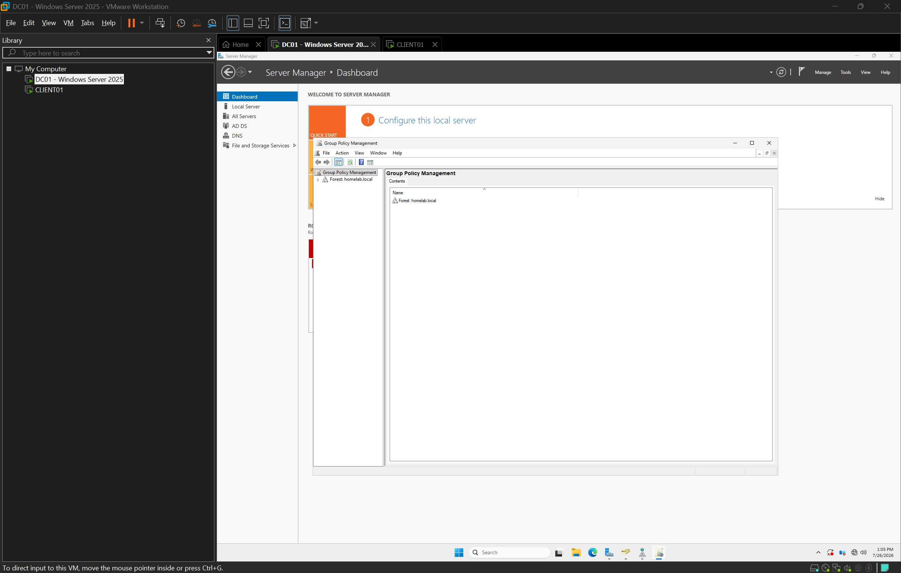
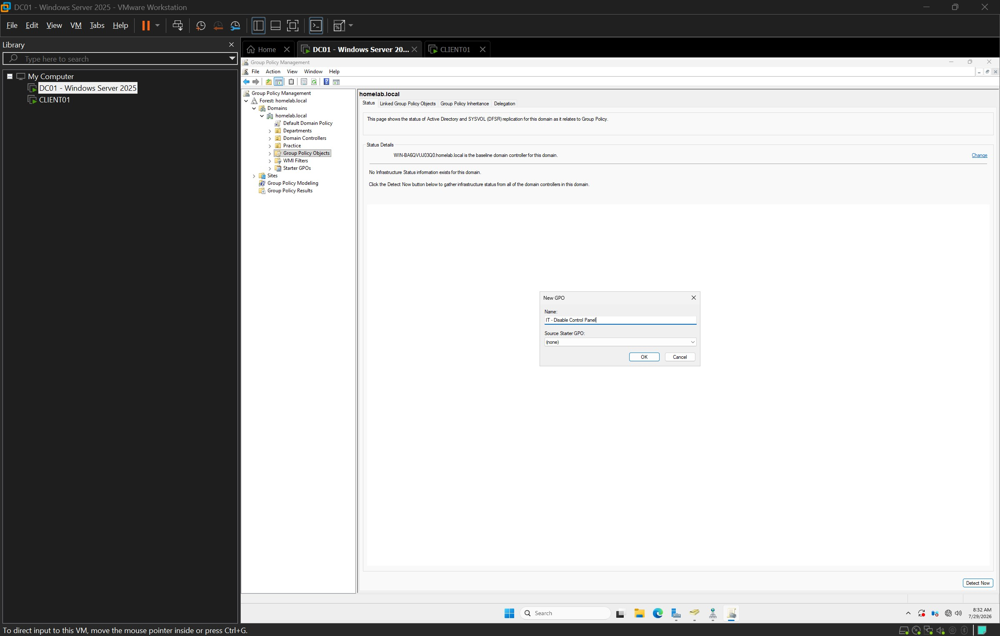
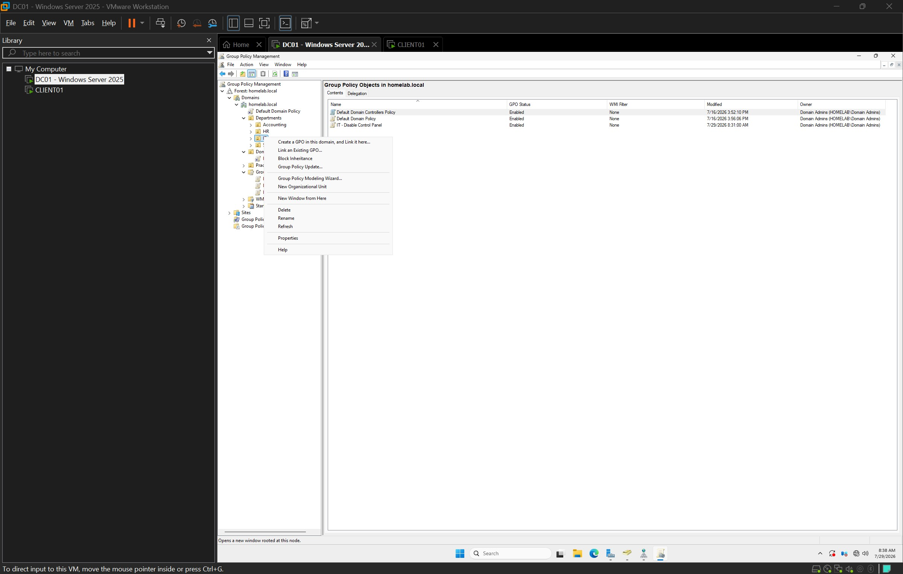
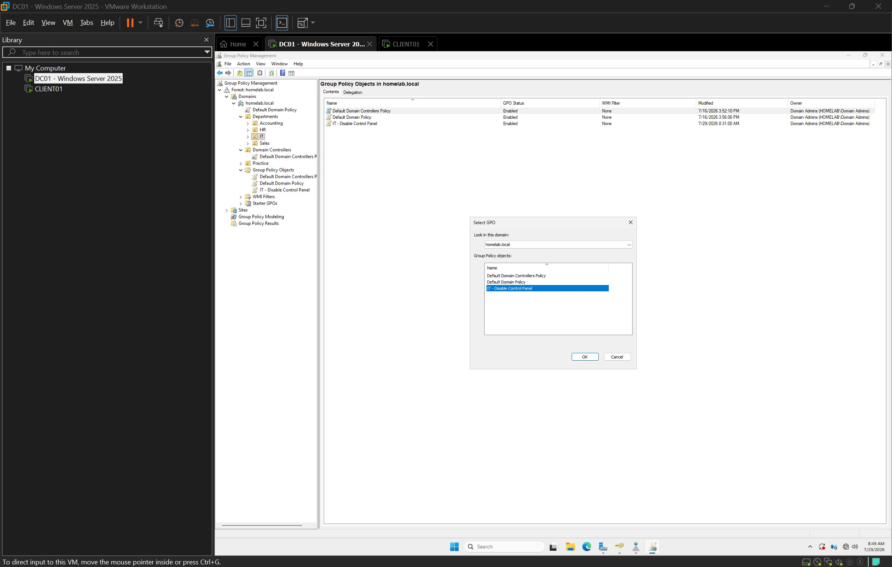
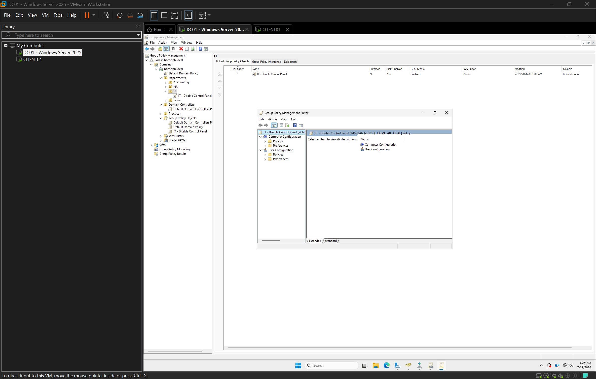
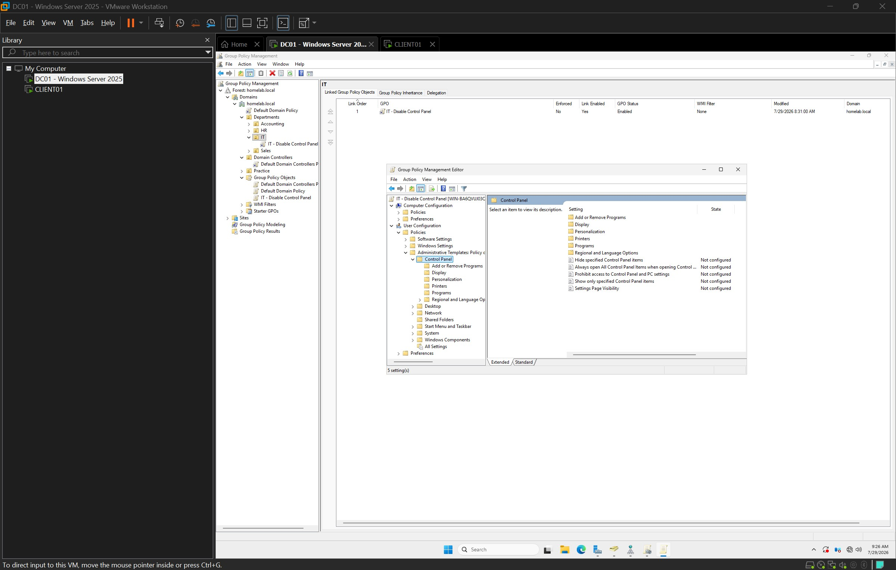
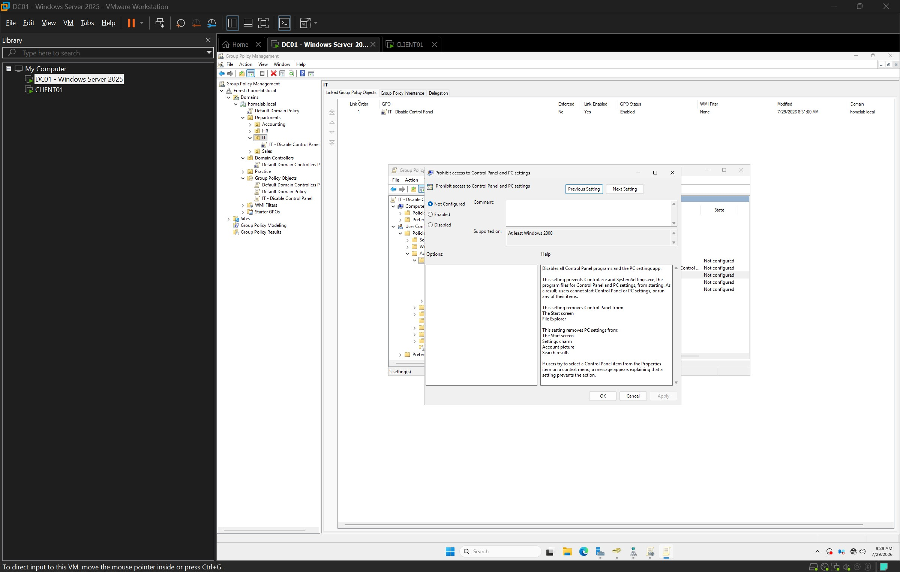
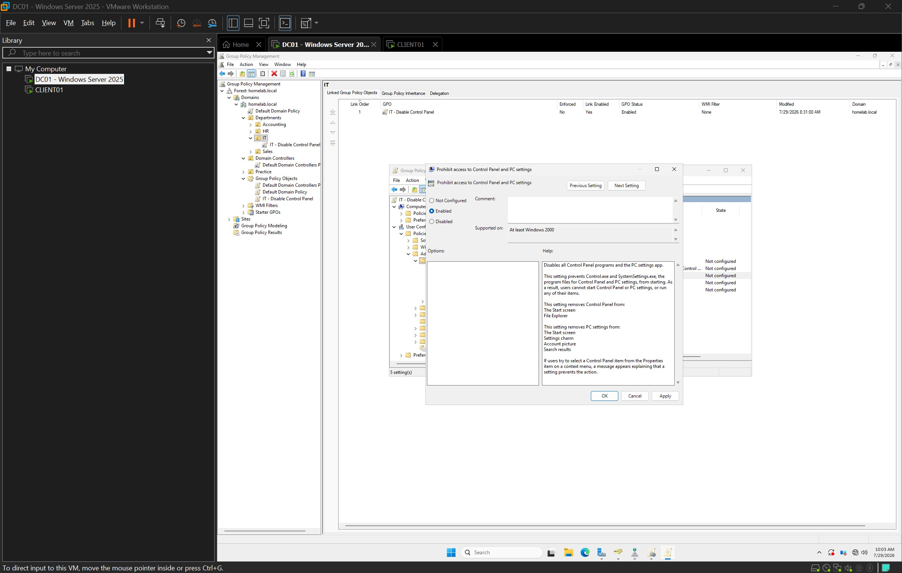
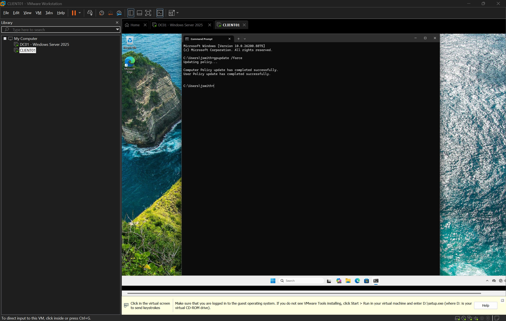
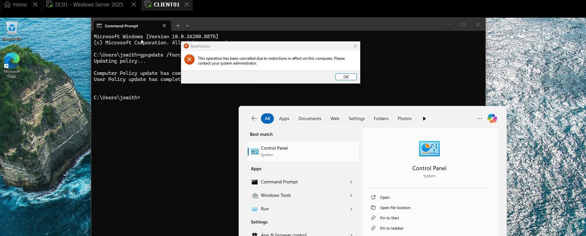

# Create and Link Group Policy Objects

## Overview

This section documents the process of creating, configuring, and linking a Group Policy Object (GPO) within an Active Directory domain using Windows Server 2025.

Group Policy is one of the most powerful management tools in a Windows Server environment. It allows administrators to centrally configure operating system settings, security policies, user restrictions, desktop configurations, software deployment, and many other administrative settings across an enterprise network.

In this lab, a custom Group Policy Object was created, linked to the IT Organizational Unit (OU), configured to restrict access to the Control Panel, and successfully applied to a domain user on a Windows 11 client computer.

---

# Lab Environment

| Component | Configuration |
|-----------|---------------|
| Hypervisor | VMware Workstation Pro |
| Domain Controller | Windows Server 2025 |
| Client Computer | Windows 11 |
| Active Directory Domain | homelab.local |
| Organizational Unit | IT |
| Test User | homelab\JohnSmith |
| Group Policy Management | Installed |
| Test Policy | Prohibit access to Control Panel and PC Settings |

---

# Objectives

- Create a new Group Policy Object (GPO)
- Understand the difference between creating and linking a GPO
- Link the policy to the IT Organizational Unit
- Configure a User Configuration policy
- Force a Group Policy update
- Verify that the policy is successfully applied on the client computer

---

# Procedure

## 1. Open Group Policy Management

Group Policy Management was launched from Server Manager to manage domain-wide Group Policy Objects.

**Screenshot**



---

## 2. Create a New Group Policy Object

A new Group Policy Object named **IT - Disable Control Panel** was created inside the Group Policy Objects container.

Creating the GPO only creates the policy object—it does not affect any users or computers until it is linked to an Active Directory container.

**Screenshot**



---

## 3. Link the GPO to the IT Organizational Unit

The existing Group Policy Object was linked to the IT Organizational Unit.

This ensures that only users and computers within the IT OU receive the policy instead of every object in the domain.

**Screenshot**



---

## 4. Select the Existing Group Policy Object

The previously created GPO was selected from the available Group Policy Objects.

Windows allows a single GPO to be linked to multiple Organizational Units, making policy management more efficient.

**Screenshot**



---

## 5. Open the Group Policy Management Editor

The Group Policy Management Editor was opened to configure policy settings.

The editor separates policies into two primary categories:

- Computer Configuration
- User Configuration

Each section controls different aspects of Windows management.

**Screenshot**



---

## 6. Navigate to the Control Panel Policies

The following policy path was opened:

```
User Configuration
└── Policies
    └── Administrative Templates
        └── Control Panel
```

This location contains policies used to manage Control Panel behavior for users.

**Screenshot**



---

## 7. Configure the Control Panel Restriction

The **Prohibit access to Control Panel and PC settings** policy was opened for configuration.

This policy prevents users from opening both the legacy Control Panel and the Windows Settings application.

**Screenshot**



---

## 8. Enable the Policy

The policy was configured as **Enabled** and applied to the Group Policy Object.

Once enabled, the restriction becomes active after Group Policy refreshes on client computers.

**Screenshot**



---

## 9. Force a Group Policy Update

On the Windows 11 client computer, the following command was executed:

```cmd
gpupdate /force
```

This immediately refreshed both User and Computer policies instead of waiting for the automatic refresh interval.

**Screenshot**



---

## 10. Verify Policy Application

After updating Group Policy, the Control Panel was opened.

Windows displayed a restriction message confirming that the policy was successfully applied to the domain user.

This verified that:

- The GPO was configured correctly.
- The policy was linked correctly.
- The client successfully received the policy.

**Screenshot**



---

# Skills Demonstrated

- Active Directory administration
- Group Policy Object (GPO) creation
- Organizational Unit targeting
- Group Policy linking
- Group Policy Management Editor
- User Configuration policies
- Administrative Templates
- Enterprise policy deployment
- Windows client administration
- Policy verification
- Command-line administration
- Group Policy troubleshooting

---

# Technologies Used

- Windows Server 2025
- Windows 11
- VMware Workstation Pro
- Active Directory Domain Services (AD DS)
- Group Policy Management Console (GPMC)
- Group Policy Management Editor
- Command Prompt

---

# Lessons Learned

This lab reinforced several important enterprise administration concepts:

- Creating a Group Policy Object does not automatically apply it to users or computers.
- A GPO must be linked to an Active Directory container such as a Domain, Organizational Unit, or Site before it takes effect.
- User Configuration policies apply to user accounts, while Computer Configuration policies apply to computer objects.
- The `gpupdate /force` command allows administrators to immediately refresh Group Policy settings without waiting for the automatic refresh interval.
- Group Policy provides centralized management that enables administrators to efficiently configure and enforce security and administrative settings across enterprise environments.

---

# Related Documentation

- [Active Directory](../../active-directory/README.md)
