# Static IPv4 Configuration & Network Connectivity

## Objective

Configure a Windows Server with a static IPv4 address to provide a consistent network identity for future enterprise services such as Active Directory and DNS.

---

## Environment

- Hypervisor: VMware Workstation Pro
- Operating System: Windows Server 2025
- Network Type: NAT (VMnet8)

---

## Initial Configuration

The server was initially configured to obtain its IPv4 address and DNS server automatically using DHCP.

The current configuration was inspected using:

```powershell
ipconfig /all
```

The following information was identified:

- IPv4 Address
- Subnet Mask
- Default Gateway
- DHCP Server
- DNS Server
- DHCP Status

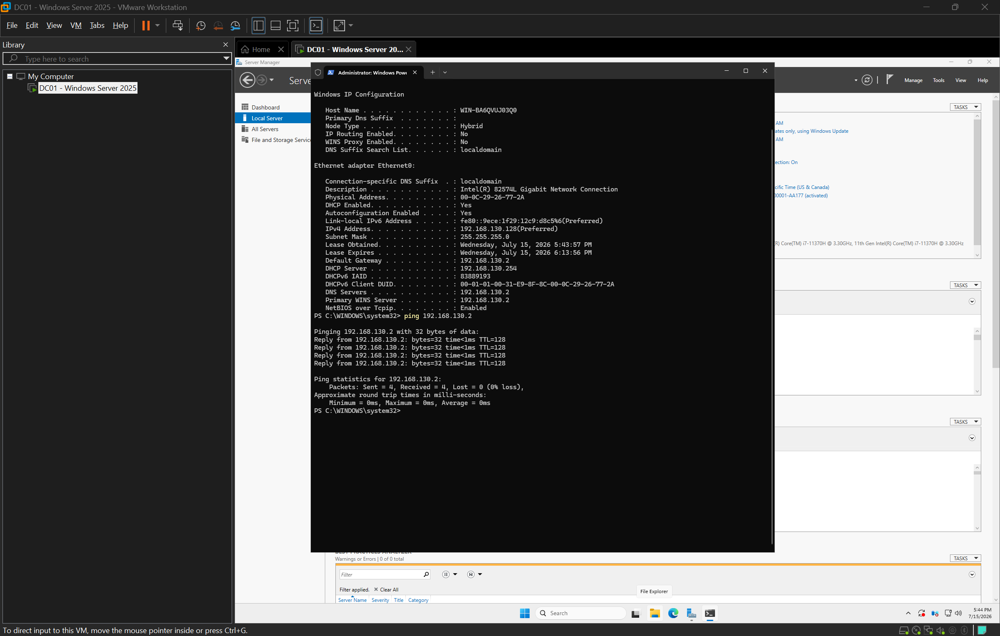

---

## DHCP Scope Investigation

The VMware DHCP scope was reviewed before assigning a static address.

DHCP Range:

- Start: 192.168.130.128
- End: 192.168.130.254

To avoid potential IP conflicts, a static address outside of the DHCP scope was selected.

Assigned Static Address:

- IP Address: 192.168.130.10
- Subnet Mask: 255.255.255.0
- Default Gateway: 192.168.130.2
- Preferred DNS Server: 192.168.130.2

The VMware DHCP scope and the configured static IPv4 settings are shown below.

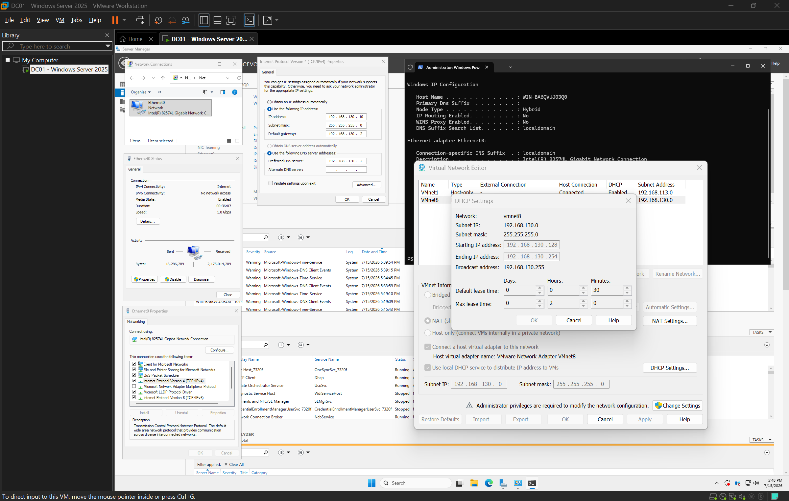

---

## Verification

The configuration was verified using:

```powershell
ipconfig /all
```

The output confirmed:

- DHCP Enabled: No
- Static IPv4 address assigned successfully

Network connectivity was verified using:

```powershell
ping 192.168.130.2
```

DNS name resolution was verified using:

```powershell
nslookup google.com
```

The successful connectivity and DNS verification are shown below.

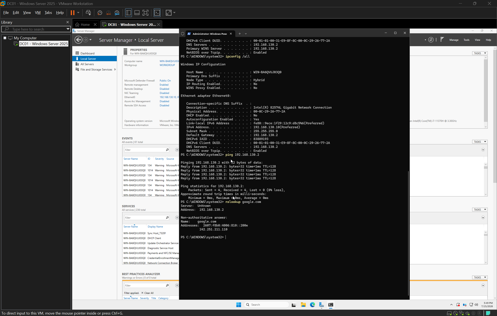

---

## Client-to-Server Connectivity Testing

After assigning a static IPv4 address, network connectivity was tested between **DC01** and **CLIENT01**.

### Initial Test

The first ICMP (ping) tests failed in both directions.

DC01 could not reach CLIENT01.

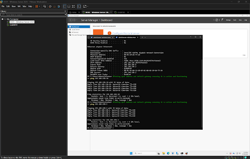

CLIENT01 could not reach DC01.

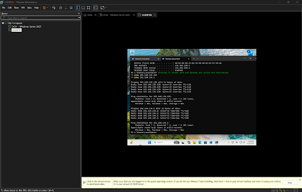

---

### Connectivity Investigation

PowerShell was used on both systems to verify the current network configuration and confirm that each machine had the expected IPv4 configuration.

CLIENT01 network verification:

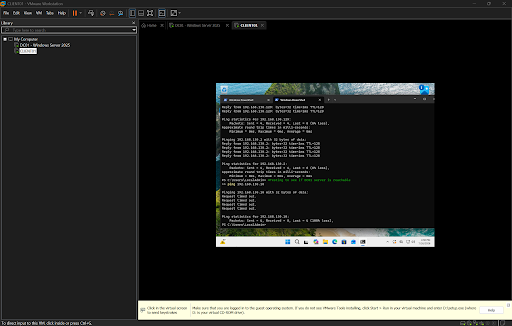

DC01 network verification:

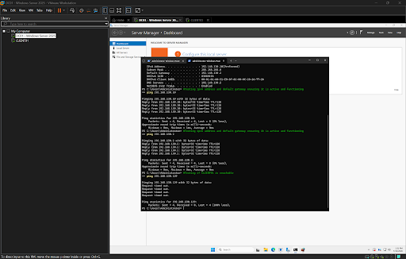

Both systems were confirmed to be on the same subnet with valid IP configurations. This indicated that IP addressing was not the cause of the connectivity issue.

---

### Root Cause

Windows Defender Firewall was blocking inbound ICMP Echo Requests (ping).

The inbound **File and Printer Sharing (Echo Request - ICMPv4-In)** firewall rule was enabled on DC01.


After enabling the rule, CLIENT01 successfully communicated with DC01.

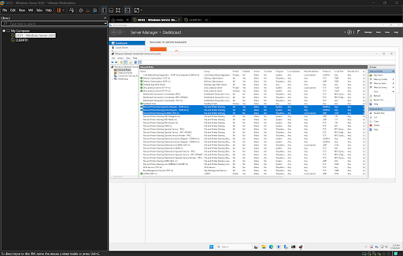

The same firewall rule was then enabled on CLIENT01.

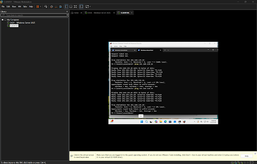

DC01 was then able to successfully communicate with CLIENT01.

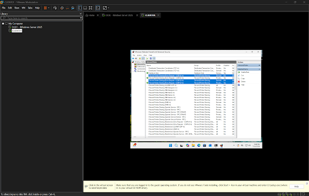

---

### Final Verification

Bidirectional communication between both systems was successfully verified.

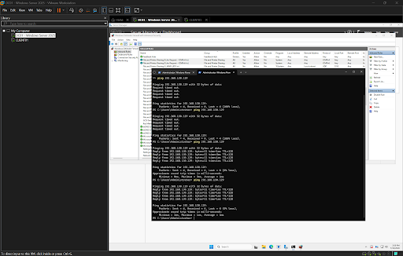

---

## Break/Fix Exercise

To reinforce the configuration process, the server was intentionally returned to DHCP.

The resulting configuration was investigated using PowerShell.

The server was then restored to its static IPv4 configuration without referencing previous notes.

After restoration, connectivity and DNS resolution were successfully verified.

---

## Skills Demonstrated

- Windows Server Administration
- Static IPv4 Configuration
- VMware Virtual Networking
- DHCP Investigation
- Windows Defender Firewall
- ICMP (Ping) Troubleshooting
- Client-to-Server Connectivity Testing
- DNS Verification
- PowerShell
- Network Troubleshooting
- Break/Fix Troubleshooting

---

## Commands Used

```powershell
ipconfig /all

ping 192.168.130.2

ping 192.168.130.10

nslookup google.com

Get-NetFirewallRule

Enable-NetFirewallRule
```

---

## Lessons Learned

A server providing enterprise services should use a static IPv4 address instead of DHCP to ensure clients and services can reliably locate it.

Selecting a static address outside the DHCP scope helps reduce the risk of IP address conflicts with dynamically assigned devices.

Verifying changes using PowerShell commands after configuration is an essential part of the administrative process.

Network connectivity issues are not always caused by incorrect IP addressing. Verifying IP configuration before investigating Windows Defender Firewall helped isolate the root cause quickly. Enabling the appropriate ICMP firewall rules restored successful communication between the server and client.

This lab reinforced a structured troubleshooting methodology: verify the network configuration first, identify the root cause through testing, implement the appropriate fix, and confirm the solution by validating bidirectional communication between systems.
